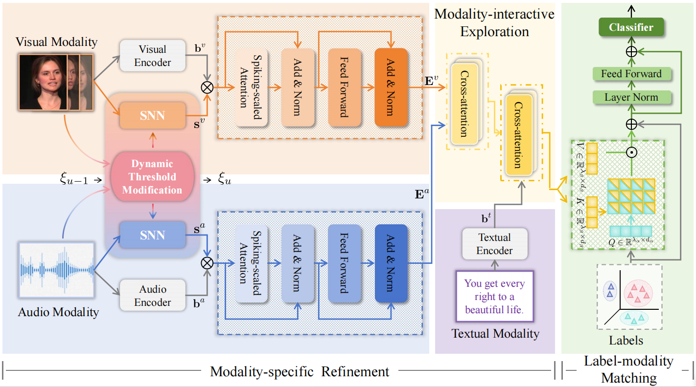

# SMILE: Spiking Multi-modal Interactive Label-guided Enhancement Network for Emotion Recognition
  
Multi-modal multi-label emotion recognition has gained significant attention in the field of affective computing, enabling various signals to distinguish complex emotions accurately.
However, previous studies primarily focus on capturing invariant representations, neglecting the importance of incorporating the fluctuation of temporal information which affects
the model robustness. In this paper, we propose a novel
Spiking Multi-modal Interactive Label-guided Enhancement
network (SMILE). It introduces the spiking neural network
with dynamic thresholds, allowing flexible processing of temporal information to enhance the model robustness. Furthermore, it employs spiking-scaled attention to enrich semantic
information. In addition to modality-specific refinement,
SMILE incorporates the modality-interactive exploration and
label-modality matching modules to capture multi-modal
interaction and label-modality dependence. Experimental
results on benchmark datasets CMU-MOSEI and NEMu
demonstrate the superiority of SMILE over state-of-the-art
models. Notably, SMILE achieves a significant 28.5% improvement in accuracy compared to the benchmark method
when evaluated on the NEMu dataset. 

## Architecture:   

The modality-specific refinement module incorporates visual, audio and textual feature
extraction (denoted by orange, blue and purple blocks respectively). The “Dynamic Threshold Modification” block flexibly
adjusts the spike thresholds. The fine-grained semantic and temporal information of visual and audio modalities are further
investigated by the spiking-scaled attention. Multi-modal interaction and label-modality dependence are captured through the
modality-interactive exploration module and the label-modality matching module.

## Usage
### Datasets
CMU-MOSEI files can be downloaded from [here](https://github.com/CMU-MultiComp-Lab/CMU-MultimodalSDK)

NEMu files can be downloaded from [here](https://github.com/MANLP-suda/HHMPN)
### Environment
  pytorch=1.8.0 ,spikingjelly==0.0.0.0.14,scipy=1.6.2
