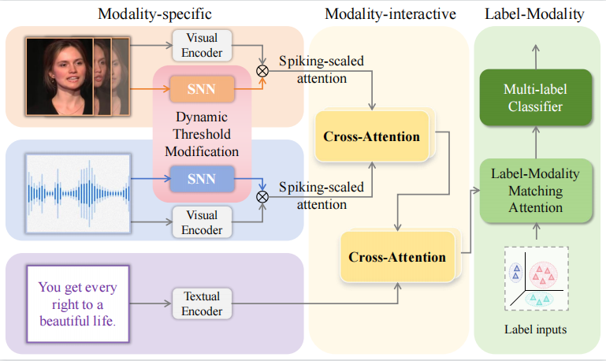

# SMILE: Spiking Multi-modal Interactive Label-guided Enhancement Network for Emotion Recognition

Abstract：  
Multi-modal multi-label emotion recognition has gained significant attention in the field of affective computing which enables the utilization of various signals to accurately distinguish complex emotions. However, previous studies primarily focus on capturing invariant representations, neglecting the importance of incorporating temporal information and accounting for the interactive dependency among modalities and labels. Consequently, the fluctuation of temporal information adversely affects the robustness of these models. In this paper, we address these challenges by proposing a novel framework, SMILE, the Spiking Multi-modal Interactive Label-guided Enhancement network. SMILE introduces the spiking neural network with dynamic thresholds, enabling flexible processing of temporal information to enhance the model robustness. Furthermore, it employs spiking-scaled attention to enrich semantic information. In addition to modality-specific refinement, SMILE incorporates the modality-interactive exploration and label-modality matching modules to capture multi-modal interaction and label-modality dependency. Experimental results on benchmark datasets CMU-MOSEI and NEMu demonstrate the superiority of SMILE over state-of-the-art models. Notably, SMILE achieves a significant 27.7% improvement in accuracy compared to the benchmark method when evaluated on the NEMu dataset.

Architecture:

### Environment
  pytorch=1.8.0 ,spikingjelly==0.0.0.0.14,scipy=1.6.2
