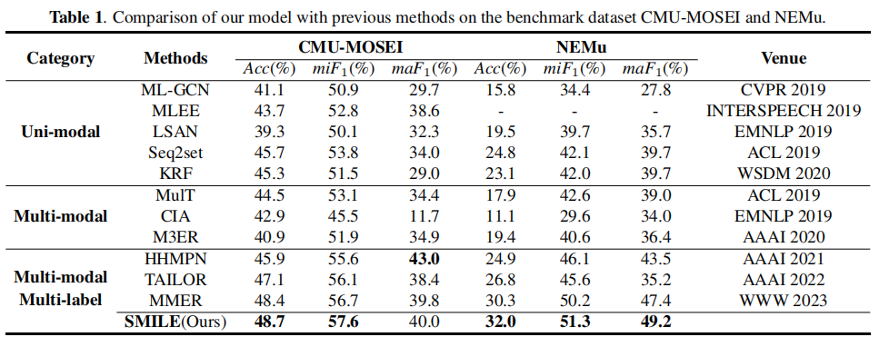

# SMILE: Spiking Multi-modal Interactive Label-guided Enhancement Network for Emotion Recognition
  
Multi-modal multi-label emotion recognition has gained significant attention in the field of affective computing, enabling various signals to distinguish complex emotions accurately.
However, previous studies primarily focus on capturing invariant representations, neglecting the importance of incorporating the fluctuation of temporal information which affects
the model robustness. In this paper, we propose a novel
Spiking Multi-modal Interactive Label-guided Enhancement
network (SMILE). It introduces the spiking neural network
with dynamic thresholds, allowing flexible processing of temporal information to enhance the model robustness. Furthermore, it employs spiking-scaled attention to enrich semantic
information. In addition to modality-specific refinement,
SMILE incorporates the modality-interactive exploration and
label-modality matching modules to capture multi-modal
interaction and label-modality dependence. Experimental
results on benchmark datasets CMU-MOSEI and NEMu
demonstrate the superiority of SMILE over state-of-the-art
models. Notably, SMILE achieves a significant 28.5% improvement in accuracy compared to the benchmark method
when evaluated on the NEMu dataset. 

## Architecture   

The modality-specific refinement module incorporates visual, audio and textual feature
extraction (denoted by orange, blue and purple blocks respectively). The “Dynamic Threshold Modification” block flexibly
adjusts the spike thresholds. The fine-grained semantic and temporal information of visual and audio modalities are further
investigated by the spiking-scaled attention. Multi-modal interaction and label-modality dependence are captured through the
modality-interactive exploration module and the label-modality matching module.

## Usage
### Datasets
CMU-MOSEI files can be downloaded from [here](https://github.com/CMU-MultiComp-Lab/CMU-MultimodalSDK)

NEMu files can be downloaded from [here](https://github.com/MANLP-suda/HHMPN)

### Feature Extraction
 For CMU-MOSEI, the visual, audio and textual features are extracted from videos by FACET, COVAREP and GloVe, respectively. 

 For NEMu, the visual, audio and textual features are extracted by ResNet, Librosa for MFCCs and GloVe, respectively.

### Environment
  pytorch=1.8.0 ,spikingjelly==0.0.0.0.14,scipy=1.6.2

## Related Work
### Multi-modal Emotion Recognition
Considering the collaboration of emotion expression between different modalities, the research of emotion computing based on multi-modal fusion is getting more and more attention. Due to the complementary effect of different modalities in expressing emotion information, multi-modal emotion recognition is more robust and more in line with the natural expression of human behavior. MISA [1] acquires modality-invariant and modality-specific representations prior to multi-modal fusion, and learns commonalities among modalities and individual characteristics of each modality to improve fusion performance. However, such features are static and fail to capture multi-modal interactions. Due to temporal convolution, MulT [2] ensures that neighboring elements preserve sufficient awareness, thus being able to capture long-range contingencies. However, this does not encode temporal information in the true sense. HHMPN [3] utilizes graph message passing to cope with complete time series data and partial time series data. However, this method cannot deal with the the fluctuation of temporal information.

### Multi-label Classification
Multi-label classification aims to assign a set of multiple labels for each instance. According to the perspective of dealing with the problem, multi-label classification methods can be divided into three main categories: Problem Transformation (PT), Algorithm Adaptation (AA), and Ensembles of Multi-Label Classifiers (EMLCs). The essence of the PT method is to simply transform a multi-label classification problem into multiple single-label classification problems. BR [4] decouples the multi-label problem into learning an independent binary classifier for each label. LP [5] considers each unique subset in a multi-label training set as one of the classes of a new single-label classification task. Different from PT methods, the core idea of AA methods is to directly deal with the multi-label classification problem by modifying the existing suitable algorithms. The decision tree [6], support vector machine [7], neural network [8], etc. can be applied to multi-label data after extension. Finally, the combination of several methods that can process multi-label data are considered as EMLCs. 

### Spiking Neural Network
Spiking neural networks consist of neurons with temporal dynamics, synaptic structures that balance homeostasis and plasticity, and functionally specific network loops. It is highly borrowed from biologically inspired locally unsupervised and globally weakly supervised biological optimization methods. Therefore, it has powerful spatio-temporal information representation, asynchronous temporal information processing, and self-organizing learning capabilities. [9] presents a deep learning method based on the gradient descent learning rule implemented by STDP. NSTRN [10] inhibits the discrete noise events and compresses the visual and textual features to 
capture the long-time dependence in sequence input on image-text retrieval in wireless communication scenario. 

## Baselines

Methods are categorized into three groups based on the modality contribution and label setting. 
For uni-modal multi-label classification approaches that are only based on text or images, we employ early-fused multi-modal features as input [11-15]. Considering the initial single-label setup of multi-modal approaches, the multi-class classifier is replaced with multi-label classifier [2, 16, 17]. Finally, there are the multi-modal multi-label emotion detection methods [3, 18, 19]. 

### Reference
[1] Hazarika, D.; Zimmermann, R.; Poria; et al. 2020. Misa: Modality-invariant and-specific representations for multimodal sentiment analysis. In Proceedings of the 28th ACM International Conference on Multimedia, 1122–1131. 

[2] Tsai, Y.-H. H.; Bai, S.; Liang, P. P.; Kolter, J. Z.; Morency, L.-P.; and Salakhutdinov, R. 2019. Multimodal Transformer for Unaligned Multimodal Language Sequences. In ACL, 6558–6569.

[3] Zhang, D.; Ju, X.; Zhang, W.; Li, J.; Li, S.; Zhu, Q.; and Zhou, G. 2021a. Multi-modal Multi-label Emotion Recognition with Heterogeneous Hierarchical Message Passing. In AAAI, volume 35, 14338–14346. 

[4] Boutell, M. R.; Luo, J.; Shen, X.; and Brown, C. M. 2004. Learning multi-label scene classification. Pattern recognition, 37(9): 1757–1771. 

[5] Tsoumakas, G.; and Katakis, I. 2007. Multi-label classification: An overview. International Journal of Data Warehousing and Mining, 3(3): 1–13. 

[6] A. Clare, A. Clare, R.D. King. 2001. Knowledge discovery in multi-label phenotype data. Lecture Notes in Computer Science, 42-53.

[7] J. Li, J. Xu. 2009. A fast multi-label classification algorithm based on double label support vector machine. Proceedings of the International Conference on Computational Intelligence and Security, 30-35.

[8] M.-L. Zhang, Z.-H. Zhou. 2006. Multi-label neural networks with applications to functional genomics and text categorization. IEEE Transactions on Knowledge and Data Engineering, 1338-1351.

[9] Y. Bengio, T. Mesnard, A. Fischer, S. Zhang, and Y. Wu. STDP-compatible approximation of backpropagation in an energy-based model. Neural Computing, vol. 29, pp. 555–577, 2017.

[10] W.-R. Li, Z.-Y. Ma, L.-J. Deng, X.-P. Fan, and Y.-H. Tian. Neuron-based spiking transmission and reasoning network for robust image-text retrieval. IEEE Transactions on Circuits and Systems for Video Technology. 2022.

[11] Zhao-Min Chen, Xiu-Shen Wei, Peng Wang, and Yanwen Guo, “Multi-label image recognition with graph convolutional networks,” in Proceedings of the IEEE Conference on Computer Vision and Pattern Recognition, 2019, pp. 5172–5181. 

[12] Atsushi Ando, Ryo Masumura, Hosana Kamiyama, Satoshi Kobashikawa, and Yushi Aono, “Speech emotion recognition based on multi-label emotion existence model,” in Proceedings of the Conference of the International Speech Communication Association, 2019, pp. 2818–2822. 

[13] Lin Xiao, Xin Huang, Boli Chen, and Liping Jing,“Label-Specific Document Representation for Multi-Label Text Classification,” in Proceedings of the Conference on Empirical Methods in Natural Language Processing, 2019, pp. 466–475. 

[14] Pengcheng Yang, Fuli Luo, Shuming Ma, Junyang Lin, and Xu Sun, “A Deep Reinforced Sequence-to-Set Model for Multi-Label Classification,” in Proceedings of the Annual Meeting of the Association for Computational Linguistics, 2019, vol. 1, pp. 5252–5258. 

[15] Qianwen Ma, Chunyuan Yuan, Wei Zhou, Jizhong Han, and Songlin Hu, “Beyond statistical relations: Integrating knowledge relations into style correlations for multi-label music style classification,” in Proceedings of the ACM International Conference on Web Search and Data Mining, 2020, pp. 411–419. 

[16] Dushyant Singh Chauhan, Md. Shad Akhtar, Asif Ekbal, and Pushpak Bhattacharyya, “Context-aware interactive attention for multi-modal sentiment and emotion analysis,” in Proceedings of the Conference on Empirical Methods in Natural Language Processing, 2019, pp. 5646–5656. 

[17]Trisha Mittal, Uttaran Bhattacharya, Rohan Chandra, Aniket Bera, and Dinesh Manocha, “M3er: Multiplicative multimodal emotion recognition using facial, textual, and speech cues,” in Proceedings of the AAAI Conference on Artificial Intelligence, 2020, pp. 1359–1367. 

[18]Yi Zhang, Mingyuan Chen, Jundong Shen, and Chongjun Wang, “Tailor versatile multi-modal learning for multi-label emotion recognition,” in Proceedings of the AAAI Conference on Artificial Intelligence, 2022, pp. 9100–9108.

[19] Shiping Ge, Zhiwei Jiang, Zifeng Cheng, Cong Wang, Yafeng Yin, and Qing Gu, “Learning robust multi-modal representation for multi-label emotion recognition via adversarial masking and perturbation,” in Proceedings of the International World Wide Web Conferences, 2023, pp. 1510–1518. 
